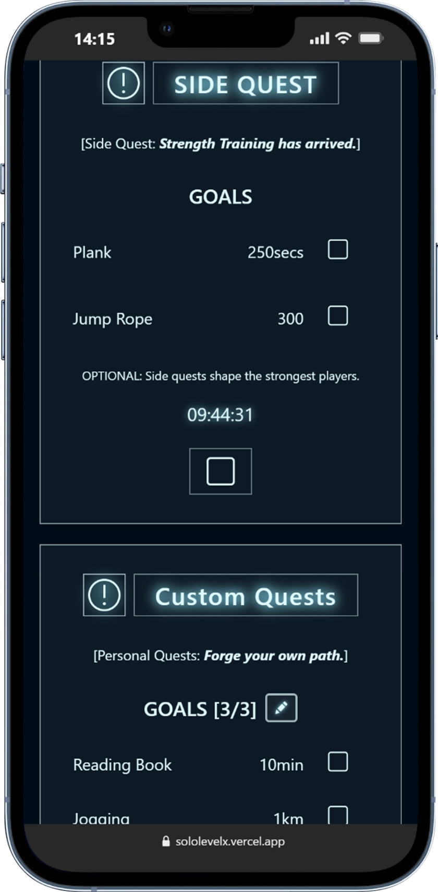
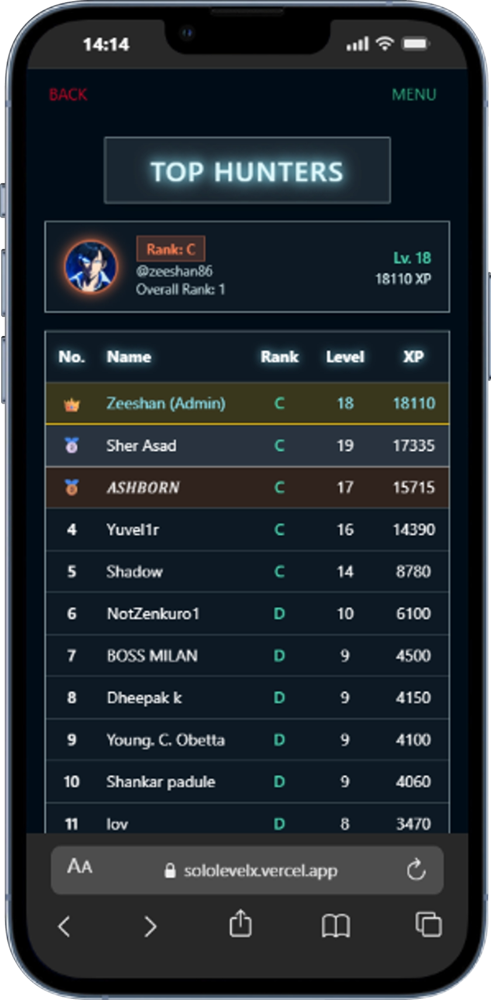

# SoloLevelX

**A Solo Leveling-inspired fitness tracking web app** built to replicate the feel of the Hunter System from the anime/manhwa, where users complete daily quests, earn XP, and climb a global leaderboard.

🌐 **Live App:** [sololevelx.vercel.app](https://sololevelx.vercel.app)
&nbsp;|&nbsp; 👥 **700+ Registered Users** &nbsp;|&nbsp; ⚡ **~30 Daily Active Users**

---

## Screenshots

<table>
  <tr>
    <td align="center"> Status & Quest Info</td>
    <td align="center">Daily & Side Quests</td>
    <td align="center"> Top Hunters Leaderboard</td>
  </tr>
  <tr>
    <td align="center"> Stats & Streak Info</td>
    <td align="center"> Quest History</td>
    <td align="center"> Home Page</td>
  </tr>
</table>

> **To add screenshots:** create a `/screenshots` folder in the repo root and place your images there with the filenames above.

---

## Motivation

A few Solo Leveling fitness apps existed before this one, but each had limitations:

| App | Limitations |
|-----|-------------|
| Arise AI | Paid, feature-heavy, UI does not match the system aesthetic |
| OurSoloLeveling | Limited to the 4 main quests, no custom quests, has since shut down |
| **SoloLevelX** | Free, actively maintained, UI designed to feel like the actual Hunter System |

The goal was to build the app that fans actually wanted: one that captures the look, feel, and structure of the system from Solo Leveling, not just a generic habit tracker with the name attached.

---

## Features

### Quest System
- **Main Quests** -- Daily mandatory challenges (push-ups, sit-ups, squats, running). Failing has consequences, just like in the system.
- **Side Quests** -- Optional bonus quests for extra XP beyond the daily minimum.
- **Custom Quests** -- Users can create their own habit-based quests, complete them at their own pace, and earn XP.

### Progression
- Earn XP by completing quests
- Level up and rank up over time (E -> D -> C -> B -> A -> S)
- HP system tied to daily quest completion
- Streak tracking -- best streak and current streak visible on the stats page

### Leaderboard
- Global Top 15 leaderboard (Top Hunters)
- Ranked by XP with level and rank displayed
- Your own rank highlighted at the top

### Quest History
- Full log of past quest completions and failures
- Cumulative stats: total push-ups, sit-ups, squats, and distance run

---

## Tech Stack

| Layer | Technology |
|-------|------------|
| Frontend | Vue.js |
| Backend | Node.js + Express.js |
| Database | MySQL |
| Deployment | Vercel + Railway |

> Built with the **MEVN stack** (MySQL, Express.js, Vue.js, Node.js)

---

## Project Status

SoloLevelX is **live and actively maintained**. Updates ship roughly every 2 to 8 weeks covering new features, UI improvements, and bug fixes. The app has been running continuously with a growing user base since launch.

---

## Disclaimer

SoloLevelX is a fan-made project inspired by the *Solo Leveling* manhwa and anime series. All rights to Solo Leveling belong to Chugong and D&C Media. This project is non-commercial and built purely out of passion for the series.
