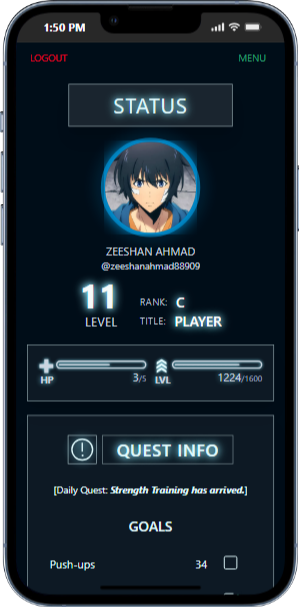
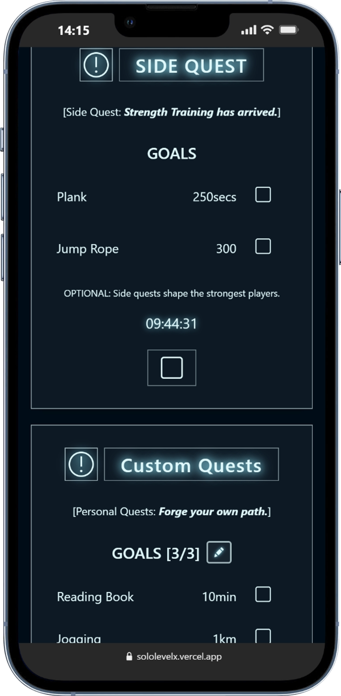
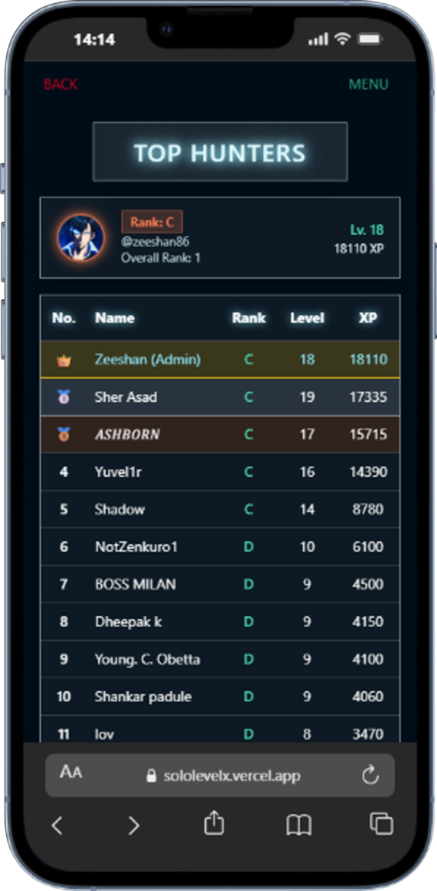
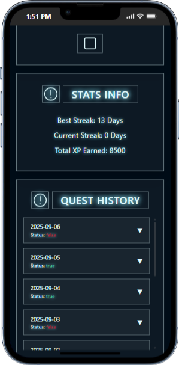
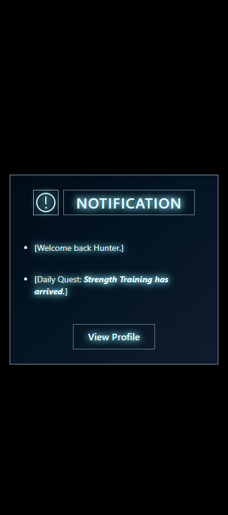

# SoloLevelX

## A Solo Leveling inspired fitness tracker that gamifies discipline through XP, leveling, HP, and personalized quests.

SoloLevelX is a gamified habit tracker and productivity app inspired by the system of the Solo Leveling anime and manhwa. It transforms daily fitness routines and habit building into an RPG-style progression system, complete with XP, leveling, HP, streaks, titles, achievements, and personalized quests that users can tailor to their own goals. A live Hunter leaderboard lets users track their rank against others, turning self-improvement into an immersive RPG-style experience. Built with Vue.js, Node.js, Express.js, and MySQL, SoloLevelX combines fitness tracking, productivity, and habit building into a system designed to keep users consistent every day.

🌐 **Live App:** [sololevelx.vercel.app](https://sololevelx.vercel.app)
&nbsp;|&nbsp; 👥 **1800+ Registered Users** &nbsp;|&nbsp; ⚡ **~65 Daily Active Users**

---

## Screenshots

<table>
  <tr>
    <td align="center"> Home Page</td>
    <td align="center"> Quests</td>
    <td align="center"> Top Hunters Leaderboard</td>
  </tr>
  <tr>
    <td align="center"> Stats & Streak Info</td>
    <td align="center"> Quest History</td>
    <td align="center"> Notification</td>
  </tr>
</table>

---

## Features

### Quest System
- **Main Quests** — Complete daily fitness challenges to maintain your progress.
- **Side Quests** — Take on optional challenges to earn additional XP and Coins.
- **Custom Quests** — Create personalized fitness or habit-based quests tailored to your goals.
- **Event Quests** — Participate in limited-time challenges for exclusive rewards.

### Weekly Training
- Create a personalized weekly workout schedule.
- Plan your workouts around your own fitness goals.

### RPG Progression
- Earn **XP** and level up by completing quests.
- Advance through Hunter ranks (**E → D → C → B → A → S**).
- Unlock **Titles** based on your achievements.
- Track your progress through stats and achievements.

### HP & Respawn System
- Start with **5 HP**.
- Missing a Main Quest costs **1 HP**.
- Reaching **0 HP** triggers a **Respawn**, resetting your progress and encouraging consistency.

### Streaks & Statistics
- Track your current and longest streaks.
- View your quest history and completion statistics.
- Monitor total workouts, running distance, and other lifetime achievements.

### Coins & Shop
- Earn **Coins** by completing quests.
- Spend Coins on XP Potions to level up faster or HP Potions to protect your progress.

### Leaderboards
- Compete with other players on the global **Top Hunters** leaderboard.
- Compare XP, Hunter Rank, and Level in real time.

### Notifications
- Daily quest reminders to help you stay consistent.
- Notifications for Event Quests and important updates.

---

## Tech Stack

| Layer | Technology |
|-------|------------|
| Frontend | Vue.js |
| Backend | Node.js + Express.js |
| Database | MySQL |
| Deployment | Vercel + Railway + Aiven |

> Built with Vue.js, Node.js, Express.js, and MySQL.

---

## Project Status

SoloLevelX is **live and actively maintained**, with regular feature updates, UI improvements, and bug fixes shipped since launch.

---

## Disclaimer

SoloLevelX is a fan-made project inspired by the *Solo Leveling* manhwa and anime series. All rights to Solo Leveling belong to Chugong and D&C Media. SoloLevelX is not affiliated with, endorsed by, or sponsored by the original creators or publishers.

## Support
SoloLevelX is free to use. If you'd like to support development, you can do so via [Gumroad](https://7414731545698.gumroad.com/coffee).
